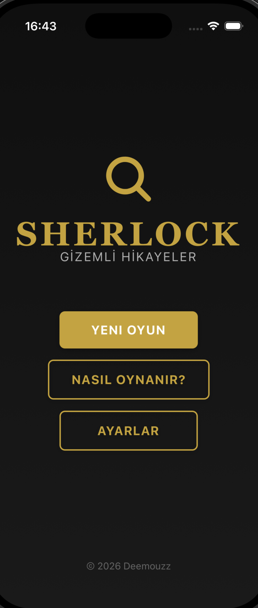
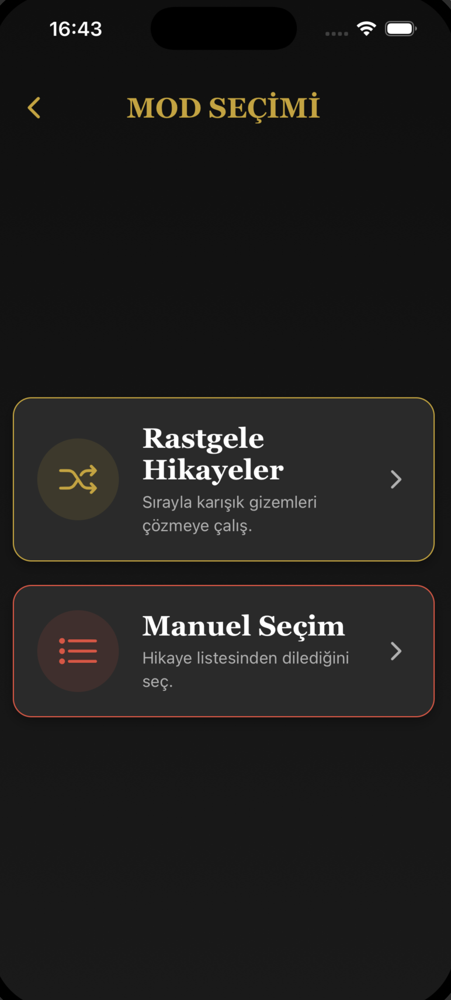
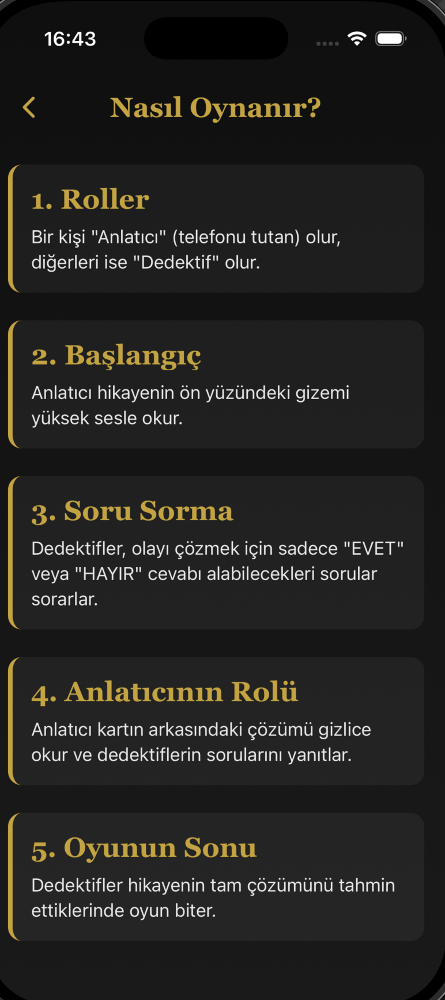
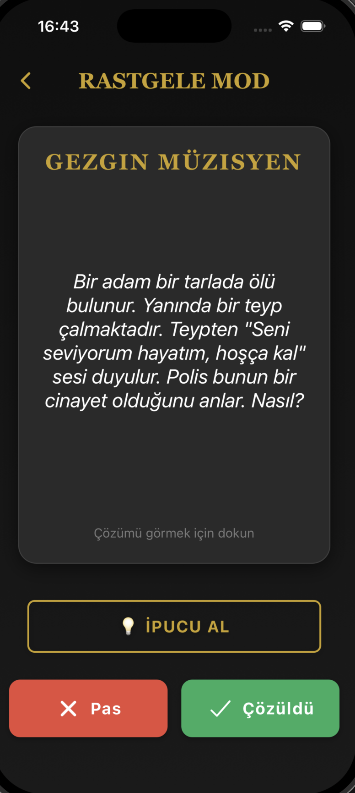
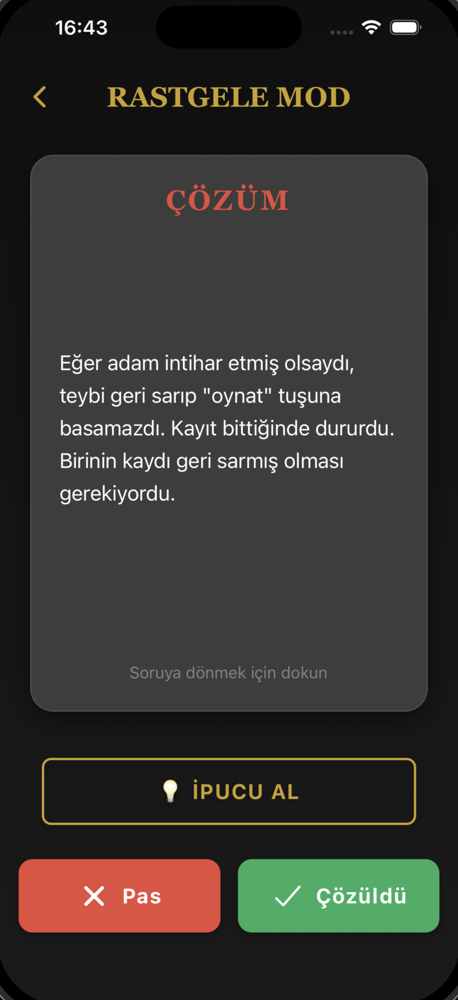
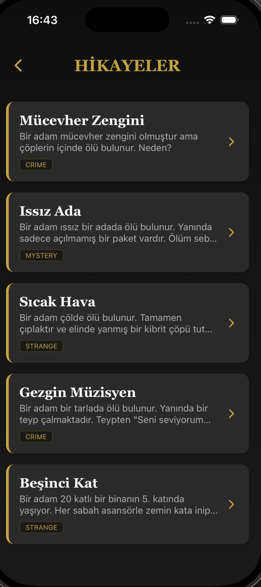

# Sherlock Game

Sherlock Game is a mobile story-based mystery game originally created as a small project among friends. The idea started as a casual game we played together in a friend group, where I was the only one who knew the full storyline. Over time, I decided to turn it into a standalone mobile experience so that others could also play and enjoy the game without needing me to explain or guide the story.

This project allows people to experience the game independently, even when I’m not present.

---

## About the Project

This game was developed using **React Native (Expo)**. During development, I also used **Gemini CLI** as an AI assistant to help speed up development and improve code quality.

One of the key architectural ideas of this project is the use of the `agents/` system.  
The game includes **4 different agents running concurrently**, each responsible for handling different parts of the game logic, creating a more dynamic and modular system design.

---

## Game Concept

Sherlock Game is a narrative-driven mystery experience where players progress through a story by interacting with clues, decisions, and character-driven events. The goal is to solve the mystery step by step while exploring the storyline.

Originally, the story was only known by me, which made it impossible for others to replay or understand without my explanation. This project solves that by making the entire experience self-contained and playable by anyone.

---

## Tech Stack

- React Native (Expo)
- JavaScript / TypeScript
- Node.js
- AI-assisted development using Gemini CLI

---

## How to Run Locally

To run this project on your local machine:

### 1. Clone the repository

```bash
git clone https://github.com/your-username/sherlock-game.git
cd sherlock-game
```

Made by Demokan Turan and Oguz Kaan Kaya

## 📸 Screenshots

Below are some screens from the game:

<p float="left">
  
  
  
</p>

<p float="left">
  
  
  
</p>
